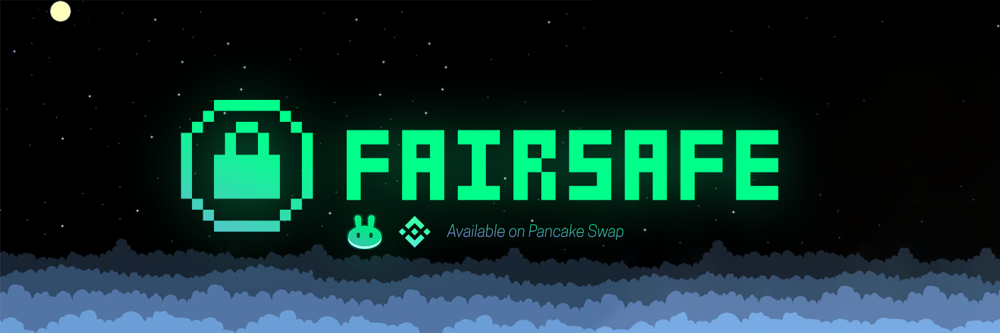

# Introduction

## FairSafe's purpose

This isn't the typical "moonshot" project, that is a very small part of it. The true purpose of this token is to bring light to layer 2 solutions into the BSC community. Like they say  **Hook, line, and sinker.** 

The current "fair" and "safe" prefix are a trend in the BSC community and a lot of people are getting hurt by these fake projects. This is what has inspired me to work on this project, while also giving people a platform to get educated on layer 2 and why it is important for de-fi. 

ETH is growing rapidly and it's not going to stop any time soon. ETH 2.0 is years away and mass attraction to crypto is now. The only second best solution people think is BSC but it isn't. Binance has way too much control for it to be called a decentralised exchange, they can shut off nodes and bridges if it fits their agenda.

This project will start out on BSC for the main reason that there is massive traffic and a lot of new people are exposed to it because of Safemoon. The main goal is to migrate to Polygon, where FairSafe will find it's true home. 

## WTFORK??? 

I won't beat around the bush unlike other "community" tokens, this is a fork of SafeMoon, which was a fork of bee, which was a fork of blah blah blah. Nothing ground breaking here. 

I am starting this project because I have seen so many of these "fair" tokens be absolutely unfair and seeing people get scammed on dxsale I thought to myself that I could make a token and actually make it... you know... FAIR. 

This is project is currently being worked on by one developer, designer and the one currently writing this: [@OxZian ](https://twitter.com/0xZian)\(twitter\) / [0xAizen ](https://github.com/0xAizen)\(github\) 

**There is also a risk of this getting outbid with gas... So please be cautious on release and do not ape in more than you can afford to lose. We are not liable for any losses and this is not a financial instrument.**

**Dxsale is not bottable due to presale contracts being unverified thus no way for bots to call contract .** 

## Tokenomics

You know what this is, reflect, frictionless yield... If you don't then you might just wanna click on [this](https://yosh-dev.medium.com/what-is-safemoon-b4c21b81b217#:~:text=Safemoon%20is%20a%20relatively%20new,in%20early%20March%20of%202021.&text=Safemoon%20is%20a%20deflationary%20crypto,value%20as%20time%20goes%20on.).

There will be 1,000,000,000,000,000 FairSafe Token in existence

FairSafe employs 3 simple functions: Reflection + LP acquisition + Burn In each trade, the transaction is taxed a 8% fee, which is split 2 ways. 

* 3% fee = redistributed to all existing holders
* 5% fee is split 50/50 half of which is sold by the contract into BNB, while the other half of the FairSafe tokens are paired automatically with the previously mentioned BNB and added as a liquidity pair on Pancake Swap.

\(yes i copypasta safemoon description 😂 because this is literally what the token is right now\)

To maximize the fairness for each investor there will only have a maximum allocation of 2 BNB per TX. 

The presale and listing price will be the same: 2,000,000,000,000 FSAFE = 1 BNB.

Token will be renounced once presale is finalised. This means that the current protocol will NOT be deflationary as I will not have the ability to create a synthetic burn for the token.

## Token distribution

Please do not trust any sources outside this whitepaper 

Presale Address: [0xd8372714C138BB0d5F7A665B4893B8983c3Ea688](https://bscscan.com/address/0xd8372714C138BB0d5F7A665B4893B8983c3Ea688)

Token Address: [0xEE738a9e5FB78c24D26ceCD30389ED977C38D0Ca](https://bscscan.com/address/0xEE738a9e5FB78c24D26ceCD30389ED977C38D0Ca)

Marketing tokens: 145,000,000,000,000 FSAFE \(Locked for 24 hours and vested\) - Remember community owned if community is not comfortable with this it can be adjusted, but please be aware that these marketing services are not free. \(I wish they were\) 

| Type of allocation | Amount |
| :--- | :--- |
| Tokens available for presale: | 250,000,000,000,000 FSAFE |
| At listing: | 200,000,000,000,000 FSAFE |
| Platform fee: | 5,000,000,000,000 FSAFE |
| Total:  | 455,000,000,000,000 FSAFE |

Burnt tokens: 400,000,000,000,000 FSAFE

## Dxsale details

Softcap: 25 

Hardcap: 125 

Liquidity Unlocks: 7 APR **2025** at 13:00 \(4 Years\)

Hard cap is high so tokens can circulate to more holders, lower hardcap = higher chances of getting dumped on. This is the idea anyway, but there will likely be bots on the dxsale presale page. So please proceed with caution

## Token use case 

At the current development cycle there is no use case for the token, just like many tokens. But as the project progresses the plan is for the token to be used for governance to vote for community activities and the future of the protocol. 

* Governance implementation
* NFT Market Place: Market place for artist that is fair and safe + future NFT released by FairSafe. 
* NFT Clothing - Creating merch that will be available for purchase, users can chose to mint nft or get it delivered to them. If user mints clothing into nft it will be sent to their address via ERC721 token and physical merch will be burnt video of clothing burn will be uploaded as a ERC721 token for proof. 

