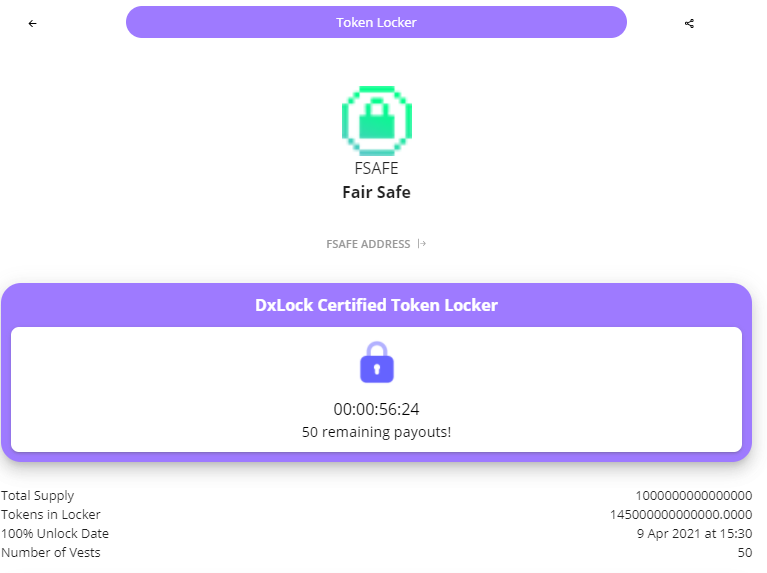

# Token lock \(15% of supply\)

## Arc 1: Inception

As you all know 14.5% is locked up in a the [Dxtoken](https://dxsale.app/app/pages/dxlockview?id=0&add=0xCdF5817D058F05A14F56ebCA293dD6ce6dfF7D1e&type=tokenlock&chain=BSC) contract. When the timer reaches 0% I will lock these tokens again. Initially I didn't think this project will attract so many like minded people, since I didn't think we would be able to reach the 125 BNB HARDCAP I left a lot of tokens for marketing so we could gain momentum. 

But things have changed. In just 24 hours, we have managed to gather 2,697 holders. With the market cap rising holding this many tokens for marketing just does not seem reasonable. 

## Arc 2: The beginning of the end

This is the start for us as a community to put an end to [rugpulls](https://coinmarketcap.com/headlines/news/dark-side-of-defi-millions-usd-worth-of-eth-lost-to-uniswap-rug-pulls/#:~:text=Rug%20Pulls%3A%20The%20Plague%20of,demand%20for%20this%20swapping%20pair.). These funds were initially made for marketing. But I have come up with a better solution since this allocation is now too much for just marketing. This will be the official community fund, where active hodlers who are part of the community will be incentivised with airdrops coming from this fund. More details about the airdrops on the upcoming patch 1.01 of the this white paper. 

## Arc 3: Not a mathematician 

14.5% is a big sum and I am gonna be honest with you. I just got lazy to calculate the amount for the Token to 125 Hardcap ratio. Originally the plan was for a 250 Hardcap and 1T FSAFE per BNB. But one of the earliest members suggested that this number was too high... Oh little did we know. This gave me a lot of doubt.

I then adjusted the numbers in preparation for the launch for 2T BNB per FSAFE and 125 Hardcap. To reach a total of [455T FSAFE](https://bscscan.com/tx/0x7a58e2fc9f4a27ce2de038280b1cef5c7a824a017bee7ce467d615c3ff8f4ec3) in the [LP](https://finematics.com/liquidity-pools-explained/) \(Liquidity Pool\). Then followed it with a [400T FSAFE Burn](https://bscscan.com/tx/0x8df62134d9cf50c53f119e47f9d410ffadab3b7e24f9ba77b04c357b5da00454). 

This leaves us with 145T tokens left.

_But ser is token safe?_ 

_Will you burn tokens fren?_

## Arc 4: May the vest one win

I have come to a conclusion that the best solution is to lock it up in the dxtoken page once again.

But this time for a span of 2 years vested 100 times over the course of the two years. Each time an allocation is vested hodlers will be notified, the use of these tokens will be up for the community to decide. We are in early stages so at the moment there is no DAO protocol in the current contract and it has been [renounced](https://bscscan.com/tx/0x1fbd55a3aca653f784f49cf300cd3f06d993a9b23c6b7ccbc9e4169e49745fb5). 

\(Hodlers? Don't you mean holders? New to crypto I see.. Learn about the origins of [hodlers](https://www.investopedia.com/terms/h/hodl.asp#:~:text=The%20term%20HODL%20%28or%20hodl,the%20beginning%20of%20December%202013.). \)

For now we will have to go with the old polling system on what to do with vested funds this means you need to be active within the community. Hodlers who are not invested in the project are hodlers who are not serious. 

Once the team figures out a solution for the [DAO ](https://cointelegraph.com/ethereum-for-beginners/what-is-dao)governance you will hopefully be able to delegate your FSAFE to vote on what is to be done! 

## Conclusion: LONG HOLD IMMENENT

We will update [TG ](https://t.me/fairsafe)/ [INSTA ](https://www.instagram.com/FairSafeBSC/)/ [TWITTER](https://twitter.com/FairSafeBSC) / [DISCORD](https://discord.gg/dC32qxZfKs) on any plans for the vested tokens currently these are the estimated vesting periods. 

| **Vesting Period** | **Estimated Release Date** | **TOTAL Tokens Released \(IF NOT CLAIMED\)** |
| :--- | :--- | :--- |
| 1 | 16 Apr 2021 at 23:46 | 1,450,002,629,804.8357 |
| 2 | 24 Apr 2021 at 06:58 | 2,900,005,259,609.6714 |
| 3 | 1 May 2021 at 14:10 | 4,350,007,889,414.5068 |
| 4 | 8 May 2021 at 21:22 | 5,80,001,051,9219.3428 |
| 5 | 16 May 2021 at 04:34 | 7,250,013,149,024.1787 |
| 6 | 23 May 2021 at 11:46 | 8,70001,57,78,829.0146 |
| 7 | 30 May 2021 at 18:58 | 10,150,018,408,633.8496 |
| 8 | 7 Jun 2021 at 02:10 | 11,600,021,038,438.6855 |
| 9 | 14 Jun 2021 at 09:22 | 13050023668243.5215 |
| 10 | 21 Jun 2021 at 16:34 | 14500026298048.3574 |
| 11 | 28 Jun 2021 at 23:46 | 15950028927853.1934 |
| 12 | 6 Jul 2021 at 06:59 | 17400031557658.0293 |
| 13 | 13 Jul 2021 at 14:11 | 18850034187462.8633 |
| 14 | 20 Jul 2021 at 21:23 | 20300036817267.6992 |
| 15 | 28 Jul 2021 at 04:35 | 21750039447072.5352 |
| 16 | 4 Aug 2021 at 11:47 | 23200042076877.3711 |
| 17 | 11 Aug 2021 at 18:59 | 24650044706682.2070 |
| 18 | 19 Aug 2021 at 02:11 | 26100047336487.0430 |
| 19 | 26 Aug 2021 at 09:23 | 27550049966291.8789 |
| 20 | 2 Sep 2021 at 16:35 | 29000052596096.7148 |
| 21 | 9 Sep 2021 at 23:47 | 30450055225901.5508 |
| 22 | 17 Sep 2021 at 06:59 | 31900057855706.3867 |
| 23 | 24 Sep 2021 at 14:11 | 33350060485511.2227 |
| 24 | 1 Oct 2021 at 21:24 | 34800063115316.0586 |
| 25 | 9 Oct 2021 at 04:36 | 36250065745120.8906 |
| 26 | 16 Oct 2021 at 11:48 | 37700068374925.7266 |
| 27 | 23 Oct 2021 at 19:00 | 39150071004730.5625 |
| 28 | 31 Oct 2021 at 01:12 | 40600073634535.3984 |
| 29 | 7 Nov 2021 at 08:24 | 42050076264340.2344 |
| 30 | 14 Nov 2021 at 15:36 | 43500078894145.0703 |
| 31 | 21 Nov 2021 at 22:48 | 44950081523949.9063 |
| 32 | 29 Nov 2021 at 06:00 | 46400084153754.7422 |
| 33 | 6 Dec 2021 at 13:12 | 47850086783559.5781 |
| 34 | 13 Dec 2021 at 20:24 | 49300089413364.4141 |
| 35 | 21 Dec 2021 at 03:36 | 50750092043169.2500 |
| 36 | 28 Dec 2021 at 10:49 | 52200094672974.0859 |
| 37 | 4 Jan 2022 at 18:01 | 53650097302778.9219 |
| 38 | 12 Jan 2022 at 01:13 | 55100099932583.7578 |
| 39 | 19 Jan 2022 at 08:25 | 56550102562388.5938 |
| 40 | 26 Jan 2022 at 15:37 | 58000105192193.4297 |
| 41 | 2 Feb 2022 at 22:49 | 59450107821998.2656 |
| 42 | 10 Feb 2022 at 06:01 | 60900110451803.1016 |
| 43 | 17 Feb 2022 at 13:13 | 62350113081607.9375 |
| 44 | 24 Feb 2022 at 20:25 | 63800115711412.7734 |
| 45 | 4 Mar 2022 at 03:37 | 65250118341217.6094 |
| 46 | 11 Mar 2022 at 10:49 | 66700120971022.4453 |
| 47 | 18 Mar 2022 at 18:01 | 68150123600827.2813 |
| 48 | 26 Mar 2022 at 01:14 | 69600126230632.1172 |
| 49 | 2 Apr 2022 at 09:26 | 71050128860436.9531 |
| 50 | 9 Apr 2022 at 16:38 | 72500131490241.7813 |
| 51 | 16 Apr 2022 at 23:50 | 73950134120046.6094 |
| 52 | 24 Apr 2022 at 07:02 | 75400136749851.4375 |
| 53 | 1 May 2022 at 14:14 | 76850139379656.2656 |
| 54 | 8 May 2022 at 21:26 | 78300142009461.0938 |
| 55 | 16 May 2022 at 04:38 | 79750144639265.9219 |
| 56 | 23 May 2022 at 11:50 | 81200147269070.7500 |
| 57 | 30 May 2022 at 19:02 | 82650149898875.5781 |
| 58 | 7 Jun 2022 at 02:14 | 84100152528680.4063 |
| 59 | 14 Jun 2022 at 09:26 | 85550155158485.2344 |
| 60 | 21 Jun 2022 at 16:39 | 87000157788290.0625 |
| 61 | 28 Jun 2022 at 23:51 | 88450160418094.8906 |
| 62 | 6 Jul 2022 at 07:03 | 89900163047899.7188 |
| 63 | 13 Jul 2022 at 14:15 | 91350165677704.5469 |
| 64 | 20 Jul 2022 at 21:27 | 92800168307509.3750 |
| 65 | 28 Jul 2022 at 04:39 | 94250170937314.2031 |
| 66 | 4 Aug 2022 at 11:51 | 95700173567119.0313 |
| 67 | 11 Aug 2022 at 19:03 | 97150176196923.8594 |
| 68 | 19 Aug 2022 at 02:15 | 98600178826728.6875 |
| 69 | 26 Aug 2022 at 09:27 | 100050181456533.5156 |
| 70 | 2 Sep 2022 at 16:39 | 101500184086338.3438 |
| 71 | 9 Sep 2022 at 23:51 | 102950186716143.1719 |
| 72 | 17 Sep 2022 at 07:04 | 104400189345948.0000 |
| 73 | 24 Sep 2022 at 14:16 | 105850191975752.8281 |
| 74 | 1 Oct 2022 at 21:28 | 107300194605557.6563 |
| 75 | 9 Oct 2022 at 04:40 | 108750197235362.4844 |
| 76 | 16 Oct 2022 at 11:52 | 110200199865167.3125 |
| 77 | 23 Oct 2022 at 19:04 | 111650202494972.1406 |
| 78 | 31 Oct 2022 at 01:16 | 113100205124776.9688 |
| 79 | 7 Nov 2022 at 08:28 | 114550207754581.7969 |
| 80 | 14 Nov 2022 at 15:40 | 116000210384386.6250 |
| 81 | 21 Nov 2022 at 22:52 | 117450213014191.4531 |
| 82 | 29 Nov 2022 at 06:04 | 118900215643996.2813 |
| 83 | 6 Dec 2022 at 13:16 | 120350218273801.1094 |
| 84 | 13 Dec 2022 at 20:29 | 121800220903605.9375 |
| 85 | 21 Dec 2022 at 03:41 | 123250223533410.7656 |
| 86 | 28 Dec 2022 at 10:53 | 124700226163215.5938 |
| 87 | 4 Jan 2023 at 18:05 | 126150228793020.4219 |
| 88 | 12 Jan 2023 at 01:17 | 127600231422825.2500 |
| 89 | 19 Jan 2023 at 08:29 | 129050234052630.0781 |
| 90 | 26 Jan 2023 at 15:41 | 130500236682434.9063 |
| 91 | 2 Feb 2023 at 22:53 | 131950239312239.7344 |
| 92 | 10 Feb 2023 at 06:05 | 133400241942044.5625 |
| 93 | 17 Feb 2023 at 13:17 | 134850244571849.3906 |
| 94 | 24 Feb 2023 at 20:29 | 136300247201654.2188 |
| 95 | 4 Mar 2023 at 03:41 | 137750249831459.0469 |
| 96 | 11 Mar 2023 at 10:54 | 139200252461263.8750 |
| 97 | 18 Mar 2023 at 18:06 | 140650255091068.7031 |
| 98 | 26 Mar 2023 at 02:18 | 142100257720873.5313 |
| 99 | 2 Apr 2023 at 09:30 | 143550260350678.3750 |
| 100 | 9 Apr 2023 at 16:42 | 145000262980483.2188 |

